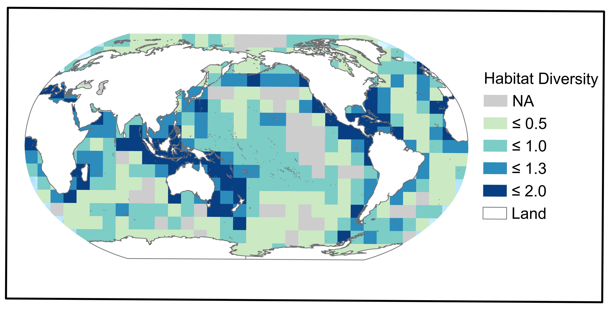

<style>
body {
text-align: justify}
</style>

```{r setup, include=FALSE}
# chunk options
knitr::opts_chunk$set(
	echo = TRUE,
	message = FALSE,
	warning = FALSE
)

# loading needed libraries

library(tidyverse)
library(broom)
library(readr)
library(knitr)
library(RCurl)

```


\pagebreak

**Preface**

This supplementary was was built with `r getRversion()` programming language and was written using R-studio IDE (v.1.2.5033) by a R-markdown file. Data and R code scripts to replicate figures and analysis can be downloaded from [**here**](https://github.com/Fabbiologia/BluePaper-10_Supplementary_informations). Please find [**the contacts informations**][Contacts] at the end of this supplementary to get in touch with the authors to report bugs or problems. 

Beware that while all data used are open source (except for kelp which source has been removed until the dataset is published), specific permission to reuse and publish them are needed from data providers. Credit for the use of those data should also go to the proper source listed in Table SI and SII. 


\pagebreak

# Section 5. Inventory of marine habitats and biodiversity

## Species

Biodiversity data can be found in Reygondeau, 2019. 

We developed a standardised database drawing on online websites with records of marine species’ global distribution and/or occurrence. Specifically, the database was populated with species data for which at least 10 spatially-informed occurrences were available. Occurrence data originated from the Ocean Biogeographic Information System (OBIS - www.iobis.org); Intergovernmental Oceanographic Commission of UNESCO (IOC- ioc-unesco.org/); the Global Biodiversity Information Facility (GBIF - www.gbif.org), Fishbase (www.fishbase.org); the Coastal and Oceanic Plankton Ecology Production and Observation database (COPEPOD - www.st.nmfs.noaa.gov/plankton); the Jellyfish Database Initiative (http://condonlab.weebly.com/); and the International Union for the Conservation of Nature (IUCN - http://www.iucnredlist.org/technical-documents/spatial-data). 

From the initial dataset (>1 billion entries), we removed records (i) with spatial location as “Not Assigned” (NA) or null values, (ii) not identified to species level, and (iii) replicated among databases (i.e., records with the same species name, coordinates, and sampling details). The remaining records (731,329,129 records, >101,000 species) were assigned full taxonomic information using the Taxize library4 in R. We also used this procedure to update all species’ synonyms to valid names, as officially recognised by the Integrated Taxonomic Information System (ITIS - www.itis.gov/) and the World Register of Marine Species (WoRMS - http://www.marinespecies.org/). Next, we explored the relationship between the number of independent records (independent in time and area of sampling) and latitudinal range and thermal range for species (see Computation and analysis of a species’ thermal niche and latitudinal range) with well-known global coverage and ecology (number of observations > 2,000, 1,196 species). For each known species, we randomly selected n records (number of observations from 1 to 1,000) within the global pool and for each selected number of records (n = 1 to 1,000 records), we computed the species' latitudinal range and thermal range. The procedure was replicated 1,000 times. We then confronted the simulated latitudinal range and thermal range (1,000 simulations) to values obtained using all the information gathered on the species. We computed an interval of confidence of known range by quantifying the difference between the 1st and 99th percentile of observed latitude coordinates and thermal value, and assumed that the acceptable number of records to capture the latitudinal and thermal range was obtained when more than 950 randomly selected records were comprised within the confidence interval determined from the global pool of records. The median number of points found to capture the latitudinal range was 33 +/- 4 records and 41 +/- 3 records for thermal range. All species with less than 41 independent records were removed from further analysis. Thus, the final dataset on which all analyses presented in this study are based comprises up-to-date taxonomic information and filtered occurrences for 41,625 species, for a total of 51,459,235 records representing 17% of all accepted marine and non-fossil species (http://www.marinespecies.org/).


*Figure S1. (A). Map of species richness on a 100 x100 km equal area grid with a superimposed countour map of the number of Habitat per geographical cell (see habitat section of this supplementary). (B) Plot of the latitudinal diversity gradient of all marine species, coastal species only and open ocean species only. (C) Plot of the average number of habitat per latitude.*

\pagebreak

## Habitats

We obtained the polygons of 6 habitats closely associated with the coast, and 6 more closely associated with open ocean, for a total of 12 majour habitats (Table SI). 

*Table SI: habitat data type, date of creation, and detailed references*

| Habitat |  Date of Data | Data Type | Source |
| :---    |     :----:    |   :----:  |   ---: |
| Estuaries | 2003 | Polygon | Alder (2003) |
| Mangroves	| 2010 - 2016 | Polygon | Giri, et al. (2011) / https://data.unep-wcmc.org/datasets/45 | 
| Saltmarsh	| 1973 - 2015 | Polygon | McOwen, et al. (2017) |
| Seagrasses | 1934 - 2015 | Polygon | UNEP-WCMC, Short FT (2017) |
| Coral Reefs | 1954 - 2018 |	Polygon | UNEP-WCMC, WorldFish Centre, WRI, TNC (2018) |
| Kelp | NA	| Point | Jorge Assis (submitted for publication) |
| Cold Corals | 1915 - 2014 |	Point	| Freiwald A (2017) |
| Sills | 1950 - 2009 | Polygon | Harris et al. (2014) |
| Seamounts/Guyots | 1950 - 2009 | Polygon | Harris et al. (2014) |
| Bridges | 1950 - 2009 | Polygon | Harris et al. (2014) |
| Rift Valleys | 1950 - 2009 | Polygon | Harris et al. (2014) |
| Hydrothermal Vents | 1994 - 2019 | Point | Beaulieu, S.E., Szafranski, K. (2019) |

### Habitat Diversity Calculations 

The global habitat diversity index was based on the twelve habitats in Table SI. First these habitats were converted into binary rasters at a 1km resolution and projected into the World Robinson projection. A constant raster was created at a resolution of 1,000km by 1,000km. Next, these rasters were imported into R Studio. The packages `raster`, `sp`, `rgdal`, and `tidyverse` were used to work with the data. Within each cell of the constant raster, the number of 1km pixels that contained a habitat were summed. Each of the cells of the constant raster was then viewed as a community and the Shannon Index of diversity was used to calculate a diversity value for each cell using the number of cells of each habitat as species counts. These values were then transformed into a raster and uploaded into ArcGIS Pro 2.4 to create Figure S2. 



*Figure S2: habitat diversity map in 1,000 km by 1,000 km grid calculated using the shannon index over the number of pixel for each habitat in the grid*


\pagebreak

# Anthropogenic impacts on marine biodiversity (Figure 1 main text)

We used the human impact undex from the paper Halpern et al., 2008 and download from [**here**](https://www.nceas.ucsb.edu/globalmarine/impacts). Data was regridded on a 110 x 110 equal area grid and overlaied with the species richness data (Figure S1) 
The relationship between species richness and the corresponding human impact index was assesed by computing the centroid of the relationship in a log-log dimension (Figure 1b). Based on the position of the geographical cell we established four categories: high richness and high impact in red, low richness and high impact in violet, high richness low impact in green, and finally low richness and low impact in blue. Then the Euclidean distance among each geographical cell to the centroid of each category has been computed, and the shades of color in Figure 1b represents these distances intervals. 


# The decline of marine species and habitats (Figure 2, 3 main text)

## Figure 2: Human-driven extinction risks

### Analysis of IUCN Red List for Levels of Extinction Risk

For marine invertebrates and vertebrates, data were extracted from the IUCN online Summary Statistics (https://www.iucnredlist.org/search). The assessment was restricted to taxa with more than 10 species assessed, to reduce bias. Whilst these taxa represent a relatively small proportion of those living in marine environments, they are the best studied to date; therefore, they present a good (if taxonomically biased) dataset on which to assess extinction threat and its causes across a range of marine ecosystems (Webb & Mindel, 2015). Only around 3% of the ~ 240,000 described marine species have been assessed for the Red List (Sullivan et al., 2019).

We note that a controversy began in the 1990s regarding the use of the IUCN extinction threat categories for commercially fished species (Rice & Legacè, 2007). The main policy instruments used for fisheries management (e.g. United Nations Convention on the Law of the Sea; the UN Fish Stocks Agreement and the FAO Code of Conduct for Responsible Fishing - see below) all highlight Bmsy (Biomass at Maximum Sustainable Yield), as a target for sustainable fisheries management. Under a sustainable management regime, it is possible to reduce a stock size to below levels which would trigger categorisation of a species or stock as threatened with extinction under the IUCN Red List criterion of decline in population size, while other fisheries management reference points indicate the stock can still be exploited (Rice & Legacè, 2007). Whilst this has been a subject of debate (see Rice & Legacè, 2007), more recent studies have demonstrated that conservation metrics as assessed by Red List criteria align well with fisheries assessments of stock status (e.g. Davies & Baum, 2012; Fernandes et al., 2017). Thus, it can be concluded that threat categories identified through the Red List criteria do not exaggerate extinction or extirpation risk and occurrences of disagreement between the two approaches are rare (Davies & Baum, 2012; Fernandes et al., 2017). IUCN have specifically identified this issue in the guidelines for applying extinction risk criteria (IUCN, 2017). 

## Figure 3: Drivers of extinction risk in the ocean

### Analysis of IUCN Red List for Drivers of Extinction

In this analysis the drivers of decline of threatened species (IUCN Red List categories Critically Endangered, Endangered and Vulnerable) in the 12 taxa for which extinction risk was assessed were summarized. Drivers of decline included: Residential and Commercial Development; Biological Resource Use; Pollution; Transport and Service Corridors; Invasive Species, Genes and Diseases; Climate Change and Severe Weather; Human Intrusions and Disturbance; Agriculture and Aquaculture; Energy Production and Mining; Natural System Modifications. Whilst many of the IUCN drivers of biodiversity decline are relatively straightforward to interpret, the category “Biological Resource Use” requires some explanation. This refers to the effects of targeted catch for commercial and artisanal fisheries, but also bycatch and/or bykill, as a cause of extinction risk; as well as a range of other harvesting activities including for the aquarium trade, marine curio trade, shell collecting and traditional medicine.
It should be noted that for many taxa there are multiple drivers of decline and we have counted each threat for each species.

\pagebreak

# Section 9. Gaps and challenges in habitat protection	p. 37

Percent Protected of the Habitats: 
To understand how much of each habitat fell within all protected areas (PA), managed protected areas, and fully protected (no take) all habitat and base layers were converted into ~1km cells in the Geographic Coordinate System GCS WGS 1984. All of the following analysis was completed in ArcGIS Pro 2.4 software. It needs to be clarified that being inside a MPA does not mean the habitat is protected, since the MPA objective and regulations may not involve the habitat. However, we consider that being inside an environmentally managed area should provide at least some indirect benefits to the habitat conservation.
The March 2020 Marine Protected Areas layers (polygons and points) were downloaded and filtered to only include PA’s where status = designated, inscribed, adopted, or established. All terrestrial MPA’s were removed (Marine = 0). UNESCO – MAB Biosphere Reserves were removed as well following UNEP-WCMC methods (https://www.protectedplanet.net/c/calculating-protected-area-coverage). For the points layer, points that had zero marine area were removed. The points were then buffered with the area of the buffer equal to the reported area. The resulting polygon and points layers were then merged together to create a final PA layer. This final PA layer was further filtered by only selecting only fully protected areas (full No-Take). In a new selected, we selected managed areas, where there was a management plan present and if the information was available, was implemented. These three layers were then converted into three rasters. 


*Table SII: additional variables used in this section* 

| Variable      | Variable name | Description | Source     |
| :---      |    :----:   | :----: |         ---: |
| Exclusive Economic Zone | eez_area | Area of the EEZ for each country in squared kilometers | Sala *et al.,* 2018 |
| Marine Protected Area | mpa | MPA extension in squared kilometers in each country. The dataset was filtered by MPAs whose status was either designated, inscribed, adopted or established, thus removing not reported and proposed categories | We obtained MPA extension from the World Database of Protected Areas (UNEP-WCMC accessed in March 2020) |
| Species Biodiversity | biodiversity_points | Extracted value of estimated species diversity | Reygondeau and Dunn (2018) |
| Gross Domestic Product per capita | gdp_total | total GDP per country (current USD) | World Bank Open data: https://data.worldbank.org/ | 
| Protected habitat area | protected | Overlap between protected area and the target habitat in squared kilometers | This paper |
| Marine Wilderness | wilderness | Areas identified from Jones et al. 2018 that have very little anthropogenic impact (lowest 10% from 15 stressors) and very low combined cumulative impact from these stressors. | Jones et al., 2018


\pagebreak

## Figure 4: Relationship among conservation efforts, world economy and natural biodiversity. 

In Figure 4, we calculated the percentage of EEZ covered by an MPA (%MPA/EEZ) and plot it against the % of world GDP of each country. Data were transformed using the base 10 logarithm. The relationship resulted significant (Table SII). In Figure XXb, we plotted biodiversity *vs* the percentage of EEZ covered by an MPA (%MPA/EEZ). This comparison resulted not significant. The grey box represent an ideal 30% of EEZ area protected target.
Data table used to create Figure 4 is available [**here**](https://raw.githubusercontent.com/Fabbiologia/BluePaper-10_Supplementary_informations/master/data/pressures_gdp_biodiversity.csv).


### Linear models

Below we calculate and report the linear model statistics of the two scatterplots in Figure 4:


*Table SIV: % MPA/EEZ vs % of World GDP regression*

```{r echo=FALSE}
pressures <- read.csv(text = getURL("https://raw.githubusercontent.com/Fabbiologia/BluePaper-10_Supplementary_informations/master/data/pressures_gdp_biodiversity.csv"))

pressures2 <- pressures %>% 
        select(country, eez_area, mpa, gdp_tot) %>% 
        na.omit() %>% 
        mutate(percent_GDP = (gdp_tot/max(gdp_tot))*100) %>% 
        mutate(percent_MPA = (mpa/eez_area)*100) 

kable(tidy(lm(log1p(percent_MPA) ~ log1p(percent_GDP), data=pressures2)))

```


*Table SV: Species Biodiversity vs % MPA/EEZ regression*
```{r echo=FALSE}
pressures3 <- pressures %>% 
        select(country, eez_area, mpa, gdp_tot, biodiversity_points) %>% 
        na.omit() %>%
        mutate(percent_MPA = (mpa/eez_area)*100) 

kable(tidy(lm(log1p(biodiversity_points) ~ log1p(percent_MPA), data=pressures3)))

```
    
      
## Figure 5. Current conservation efforts over key selected habitats.   

### Percent protected and percent in wilderness for each habitat globally calculations 

Data used to create Figure 9 is available [**here**](https://raw.githubusercontent.com/Fabbiologia/BluePaper-10_Supplementary_informations/master/Figure-09.R), and the data for Figure 11 is available [**here**](https://raw.githubusercontent.com/Fabbiologia/BluePaper-10_Supplementary_informations/master/Figure-11.R).

The amount of each habitat within marine protected areas or wilderness was calculated in ArcGIS Pro 2.4 using the data in table SI and SII. To calculate the percent of each habitat protected in the world, each PA dataset was intersected with each of the habitat layers using the “combine” tool in ArcGIS Pro, so that a total count for the pixels within all three PAs was calculated. These were then compared to the total number of pixels for each habitat to calculate a percent protected. The percent wilderness calculations were performed the same way by intersecting the habitat layers and wilderness layer from Jones et al. 2018. 
To calculate the percent of each habitat protected within each EEZ, each PA dataset was intersected with each of the habitat layers, and the rasterized EEZ/Land base layer using the “combine” tool to obtain the total number of pixels of each habitat that were protected within each country. The datasets were then exported as CSV files and uploaded into R where they were joined together. These counts were then compared to the total number of habitat pixels within each country to calculate the final percent protection of each habitat within each country. 


*Table SVI: The percent of each habitat within Marine Wilderness as defined by Jones et al. 2018 and within marine protected areas (MPAs).*
```{r echo=FALSE, warning=TRUE}
wilderness <- read.csv(
text = getURL("https://raw.githubusercontent.com/Fabbiologia/BluePaper-10_Supplementary_informations/master/data/world_wilderness_protected_table.csv"))

knitr::kable(
        wilderness %>% 
                mutate_if(is.numeric, round, 2),
        col.names = c("Habitats", 
                      "Within wilderness (%)", 
                      "Within all PAs (%)",
                      "Within managed PAs (%)",
                      "Within fully PAs (%)")
        )

```


### *Effort gap* calculations

We created Figure 5b by filtering all the habitats with a higher than 0 cover in each country and we calculated how much habitat is protected in % in each country. Then, we calculated the mean percent protected of each habitat in all the countries, and the median percent protected of each habitat in all the countries. In the plot, black circles represent countries hosting one of the key habitat in the x-axis. The y-axis represents how the percentage of area each country is protecting of that habitat within its EEZ. Most of the countries are below the 30% target (white line), which has been identified  as a threshold to ensure the maintenance of habitat’s ecosystems services. The blue circles represent the mean % of all the countries protection efforts to that habitat, whereas the red circles are the median % of all the countries protection efforts. 


\pagebreak

# Section 10. International conventions and agreements

In this paragraph, we have been using a compiled information about conventions and agreements related to marine regulations. The table used is available [**here**](https://raw.githubusercontent.com/Fabbiologia/BluePaper-10_Supplementary_informations/master/data/International_agreements.csv). 

The datatable has 1-0 values according to whether a particular convention (rows of the data) apply to a conservation topic (columns of the data). We calculated an euclidean distance followed by a Ward hierarchical clusterization technique to explore the similarities in the conventions or agreements topics. 


# Data references 

- **Biodiversity data reference**: Reygondeau, Gabriel, and Daniel Dunn. "Pelagic Biogeography☆☆☆☆." (2018).

- **Cold corals**: Freiwald A, Rogers A, Hall-Spencer J, Guinotte JM, Davies AJ, Yesson C, Martin CS, Weatherdon LV (2017). Global distribution of cold-water corals (version 5.0). Fifth update to the dataset in Freiwald et al. (2004) by UNEP-WCMC, in collaboration with Andre Freiwald and John Guinotte. Cambridge (UK): UN Environment World Conservation Monitoring Centre. URL: http://data.unep-wcmc.org/datasets/3

- **Coral Reefs**: UNEP-WCMC, WorldFish Centre, WRI, TNC (2018). Global distribution of warm-water coral reefs, compiled from multiple sources including the Millennium Coral Reef Mapping Project. Version 4.0. Includes contributions from IMaRS-USF and IRD (2005), IMaRS-USF (2005) and Spalding et al. (2001). Cambridge (UK): UN Environment World Conservation Monitoring Centre. URL: http://data.unep-wcmc.org/datasets/1

- **EEZ data reference**: Sala, E., Mayorga, J., Costello, C., Kroodsma, D., Palomares, M. L. D., Pauly, D., […] Zeller, D. (2018). The economics of fishing the high seas. Science Advances, 4(6), eaat2504. https://doi.org/10.1126/sciadv.aat2504

- **Estuaries**: Alder J (2003). Putting the coast in the “Sea Around Us”. The Sea Around Us Newsletter 15: 1-2. URL: http://seaaroundus.org/newsletter/Issue15.pdf; http://data.unep-wcmc.org/datasets/23 (version 2.0) 

- **Kelp**: Jorge Assis (submitted for publication) 

- **Mangroves**: Giri, C., E. Ochieng, L. L. Tieszen, Z. Zhu, A. Singh, T. Loveland, J. Masek, and N. Duke. (2011). “Status and Distribution of Mangrove Forests of the World Using Earth Observation Satellite Data: Status and Distributions of Global Mangroves.” Global Ecology and Biogeography 20 (1): 154–59. https://doi.org/10.1111/j.1466-8238.2010.00584.x.; downloaded from: https://data.unep-wcmc.org/datasets/45

- **Saltmarsh**: Mcowen C, Weatherdon LV, Bochove J, Sullivan E, Blyth S, Zockler C, Stanwell-Smith D, Kingston N, Martin CS, Spalding M, Fletcher S (2017). A global map of saltmarshes. Biodiversity Data Journal 5: e11764. Paper DOI: https://doi.org/10.3897/BDJ.5.e11764; Data URL: http://data.unep-wcmc.org/datasets/43 (v.6)

- **Seagrasses**: UNEP-WCMC, Short FT (2018). Global distribution of seagrasses (version 6.0). Sixth update to the data layer used in Green and Short (2003). Cambridge (UK): UN Environment World Conservation Monitoring Centre. URL: http://data.unep-wcmc.org/datasets/7

- **Sills-Rift Valleys**: Harris, P. T., Macmillan-Lawler, M., Rupp, J., & Baker, E. K. (2014). Geomorphology of the oceans. Marine Geology, 352, 4–24. https://doi.org/10.1016/j.margeo.2014.01.011
Hydrothermal vents: Beaulieu, S.E., Szafranski, K. (2018) InterRidge Global Database of Active Submarine Hydrothermal Vent Fields, Version 3.4. World Wide Web electronic publication available from http://vents-data.interridge.org Accessed 2019-02-20.

- **Wilderness** Jones, K. R., Klein, C. J., Halpern, B. S., Venter, O., Grantham, H., Kuempel, C. D., ... & Watson, J. E. (2018). The location and protection status of Earth’s diminishing marine wilderness. Current Biology, 28(15), 2506-2512.

# Literature

- Davies, T. D., & Baum, J. K. (2012). Extinction risk and overfishing: reconciling conservation and fisheries perspectives on the status of marine fishes. Scientific reports, 2(1), 1-9.

- Fernandes, P. G., Ralph, G. M., Nieto, A., Criado, M. G., Vasilakopoulos, P., Maravelias, C. D., ... & Farrell, E. D. (2017). Coherent assessments of Europe’s marine fishes show regional divergence and megafauna loss. Nature Ecology & Evolution, 1(7), 0170.

- Reygondeau, G. (2019). Current and future biogeography of exploited marine exploited groups under climate change. In Predicting Future Oceans (pp. 87-101). Elsevier.

- Rice, J. C., & Legace, E. (2007). When control rules collide: a comparison of fisheries management reference points and IUCN criteria for assessing risk of extinction. ICES Journal of Marine Science, 64(4), 718-722.

- Webb, T. J., & Mindel, B. L. (2015). Global patterns of extinction risk in marine and non-marine systems. Current Biology, 25(4), 506-511.

# Contacts

- Fabio Favoretto: favoretto.fabio@gmail.com

- Joy Kumagai: jkumagai96@gmail.com

- Octavio Aburto: maburto@ucsd.edu


---